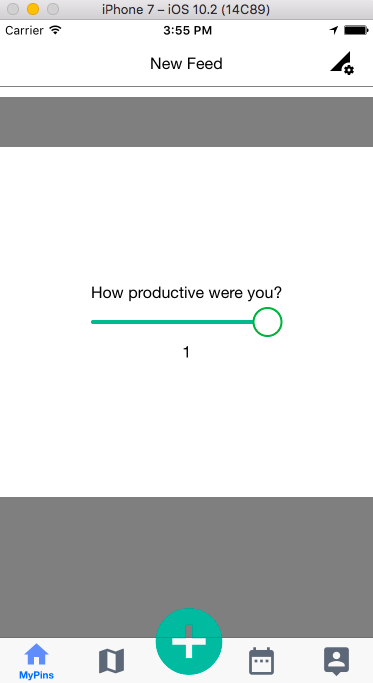

# DocBit

React Native Productivity Mobile Application

# Overview
A mobile application that allows users to track their productivity by logging hours spent doing a task in a certain location. The mobile application will generate daily reports for the user with their productivity grade at the end of each day.

# Main Page

# Goals Page
 

# Profile Page

# Report Page

# Stats Page

